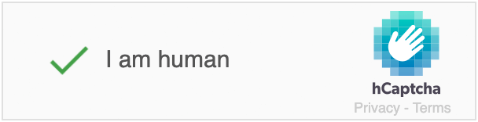

# Silverstripe hCaptcha spam protection

[](https://travis-ci.org/3dgoo/silverstripe-hcaptcha)
[](https://codecov.io/gh/3dgoo/silverstripe-hcaptcha?branch=master)
[](https://scrutinizer-ci.com/g/3dgoo/silverstripe-hcaptcha/?branch=master)
[](https://packagist.org/packages/3dgoo/silverstripe-hcaptcha)
[](https://packagist.org/packages/3dgoo/silverstripe-hcaptcha)
[](https://packagist.org/packages/3dgoo/silverstripe-hcaptcha)
[](LICENSE)

A spam protection field for Silverstripe using the hCaptcha service.



## Requirements

* Silverstripe Framework
* [Silverstripe Spam Protection](https://github.com/silverstripe/silverstripe-spamprotection/)
* [Guzzle](https://github.com/guzzle/guzzle/)

## Installation (with composer)

    $ composer require 3dgoo/silverstripe-hcaptcha

## Configuration

After installing the module via composer we must set the spam protector to HCaptchaProtector through a config yml file.

Create a `app/_config/spamprotection.yml` file and add the following details:

```yml
---
name: app-spamprotection
---
SilverStripe\SpamProtection\Extension\FormSpamProtectionExtension:
  default_spam_protector: X3dgoo\HCaptcha\Forms\HCaptchaProtector

X3dgoo\HCaptcha\Forms\HCaptchaField:
  site_key: "YOUR_SITE_KEY"
  secret_key: "YOUR_SECRET_KEY"
```

We generate our site key and secret key at https://www.hcaptcha.com/
